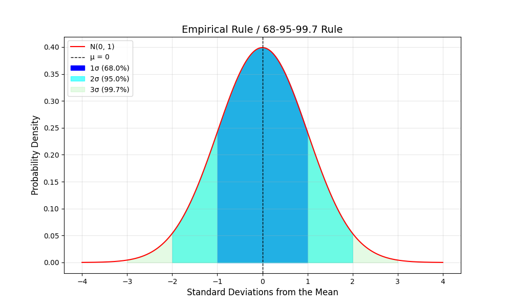

# Empirical Rule
The Empirical Rule (aliases: Three-Sigma Rule, 68-95-99.7 Rule) is a statistical rule which states for a normal distribution, almost all observed data will fall within three standard deviation ($\sigma$) of the mean ($\mu$).

Specifically, this means:\
• 68% of the data falls within $\mu \pm 1\sigma$\
• 95% of the data falls within $\mu \pm 2\sigma$\
• 99.7% of the data falls within $\mu \pm 3\sigma$

WLOG, let's show why this is the case with an example.\
Let X ~ N(0, 1), i.e., X is normally distributed with mean 0 and variance 1 (consequently, standard deviation 1).

For the first case:
$$
\begin{align*}
    \mathbb{P}(\mu - 1\sigma \leq X \leq \mu + 1\sigma)
    &= \mathbb{P}(X \leq \mu + 1\sigma) - \mathbb{P}(X \leq \mu - 1\sigma)\\
    &= \mathbb{P}(X \leq 1) - \mathbb{P}(X \leq -1)\\
    &= \Phi(1) - \Phi(-1)\\
    &\approx 0.84134 - 0.15866\\
    &= 0.68268\\
    &\approx 68\%
\end{align*}
$$

Similarly for the second case:
$$
\begin{align*}
    \mathbb{P}(\mu - 2\sigma \leq X \leq \mu + 2\sigma)
    &= \Phi(2) - \Phi(-2)\\
    &\approx 0.97725 - 0.02275\\
    &= 0.9545\\
    &\approx 95\%
\end{align*}
$$

And for the third case:
$$
\begin{align*}
    \mathbb{P}(\mu - 3\sigma \leq X \leq \mu + 3\sigma)
    &= \Phi(3) - \Phi(-3)\\
    &\approx 0.99865 - 0.00135\\
    &= 0.9973\\
    &\approx 99.7\%
\end{align*}
$$

The values for $\Phi$s above can be obtained using a z-score table. Here is an online resource we can use to find them: [ztable.net](https://www.ztable.net).

Lastly, we can visualize the Empirical Rule for our example as follows.
</img>

## References
• Hayes, Adam. "Empirical Rule: Definition, Formula, Example, How It's Used." Investopedia, 27 June 2024, [investopedia.com/terms/e/empirical-rule.asp](https://www.investopedia.com/terms/e/empirical-rule.asp).